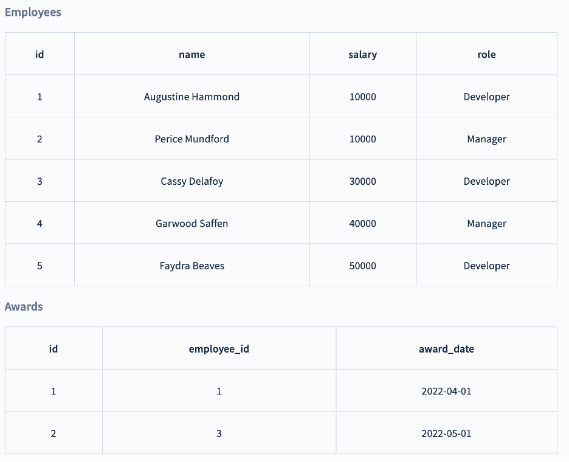
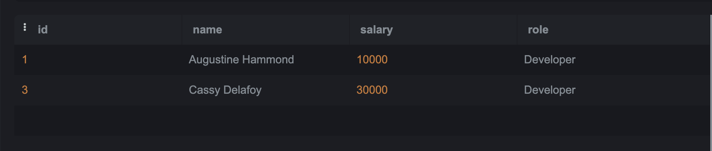
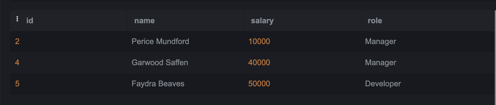
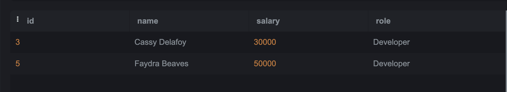
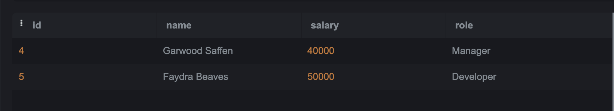

# SQL-Lab2

# We will use the Employees and Awards table below:

 

### Q1: Choose all employees who have received an award (Nested Query)?
Query: select * from employee  
where employee.id in (select awards.employee_id from awards)

Output:
 

### Q2: Choose all employees who have never received an award (Nested Query)?
Query: select * from employee  
where employee.id   not in (select awards.employee_id from awards)

Output:

 
### Q3: Choose all Developers who make more than all Managers combined (Nested Query)?
Query: select * from employee  
where role = "Developer"  and salary > (select max(salary) from employee WHERE role = "Manager")

Output:

 
### Q4: Choose all Developers who make more money than any Manager (Nested Query)?
Query:  select  * from employee
where role = 'Developer' and salary > (
select salary from employee
  where role = 'Manager'
)

Output:

 
### Q5: Choose all employees whose salaries are higher than the average for their position. (Nested Query)?

Query:SELECT * FROM employee 
WHERE salary > (
SELECT avg(salary) FROM employee 
  GROUP by role )
  Output:
